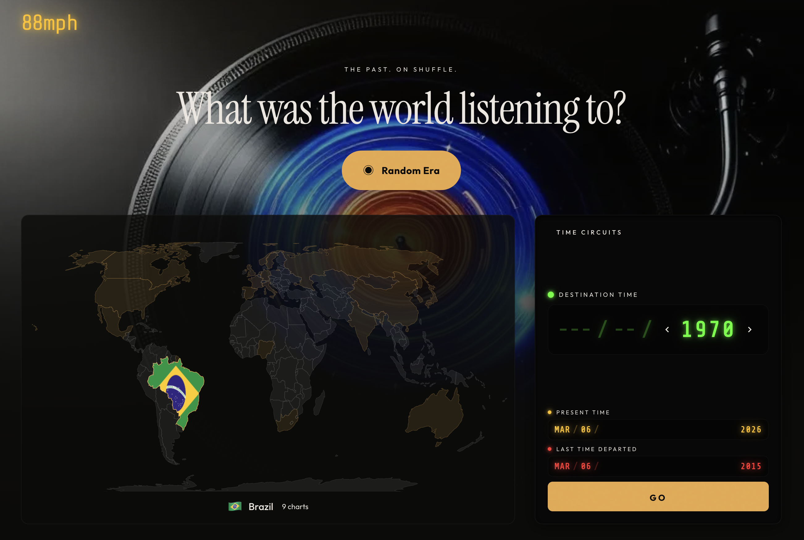
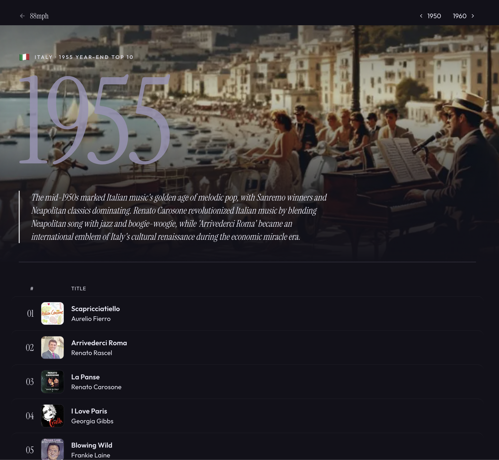

<p align="center">
  <a href="https://88mph.fm">
    
  </a>
</p>

<h1 align="center">88mph</h1>

<p align="center">
  <strong>A musical time machine.</strong><br>
  Select a country and year to discover the top 10 songs that defined an era — from 1940s big band to 2020s Afrobeats, across 20 countries.
</p>

<p align="center">
  <a href="https://88mph.fm">88mph.fm</a> &middot;
  <a href="https://github.com/matteocantiello/88mph/actions/workflows/ci.yml"></a>
</p>

## Quick Start

```bash
npm install
npm run dev
```

Open [http://localhost:3000](http://localhost:3000).

### Environment Variables

Copy `.env.local.example` to `.env.local` and fill in as needed:

| Variable | Required | Purpose |
|----------|----------|---------|
| `SPOTIFY_CLIENT_ID` | For enrichment | Spotify API client ID |
| `SPOTIFY_CLIENT_SECRET` | For enrichment | Spotify API client secret |
| `TOGETHER_API_KEY` | For postcards | Together AI API key (image generation) |
| `SPOTIFY_REFRESH_TOKEN` | For playlists | Refresh token for the 88mph Spotify account (via `scripts/spotify-get-token.mjs`) |
| `NEXT_PUBLIC_ENABLE_SPOTIFY_SAVE` | Optional | Enable legacy "Save to Spotify" button (per-user OAuth) |
| `SPOTIFY_COOKIE_SECRET` | For Save to Spotify | `openssl rand -hex 32` |
| `NEXT_PUBLIC_BASE_URL` | For Save to Spotify | Your app's public URL |

## What's Inside

- **230 charts** across **20 countries**, spanning **1940–2025**
- Interactive world map for browsing countries by region
- Back to the Future–inspired time circuit display showing destination, present, and last departed eras
- Decade-based color themes that shift the entire UI palette per era
- Cultural context blurbs for every chart (what was happening in music that year)
- AI-generated postcard hero images for each chart (FLUX via Together AI)
- Spotify album art, 30-second previews with a mini player, and "Play on Spotify" links
- YouTube video embeds for in-app playback (yt-dlp powered enrichment)
- **Pre-created Spotify playlists** — every chart has a one-click "Listen on Spotify" button linking to a curated 10-song playlist with postcard cover art
- Share button for sharing charts on social media
- Dynamic OG images (shareable chart postcards)
- Film grain overlay, editorial typography (Instrument Serif + Outfit), staggered animations
- Random "teleport" button that drops you into a surprise era

<p align="center">
  <a href="https://88mph.fm/it/1955">
    
  </a>
  <br>
  <em>Italy, 1955 — AI-generated postcard, cultural context, album art, and the year-end top 10.</em>
</p>

## Available Charts

| Country | Code | # | Years |
|---------|------|---|-------|
| USA | `us` | 29 | 1940, 1950, 1955, 1960, 1965, 1970, 1975, 1980, 1985, 1990, 1995, 2000, 2005, 2010–2025 |
| Italy | `it` | 17 | 1947, 1950, 1955, 1960, 1965, 1970, 1975, 1980, 1985, 1990, 1995, 2000, 2005, 2010, 2015, 2020, 2025 |
| UK | `uk` | 16 | 1952, 1955, 1960, 1965, 1970, 1975, 1980, 1985, 1990, 1995, 2000, 2005, 2010, 2015, 2020, 2025 |
| Germany | `de` | 14 | 1955, 1960, 1965, 1970, 1975, 1985, 1990, 1999, 2000, 2005, 2010, 2015, 2020, 2025 |
| Canada | `ca` | 12 | 1970, 1975, 1980, 1985, 1990, 1995, 2000, 2005, 2010, 2015, 2020, 2025 |
| India | `in` | 12 | 1955, 1960, 1965, 1970, 1985, 1995, 2000, 2005, 2010, 2015, 2020, 2025 |
| Spain | `es` | 11 | 1965, 1975, 1980, 1985, 1990, 2000, 2005, 2010, 2015, 2020, 2025 |
| France | `fr` | 11 | 1955, 1960, 1965, 1980, 1995, 2000, 2005, 2010, 2015, 2020, 2025 |
| Japan | `jp` | 11 | 1968, 1970, 1975, 1985, 1995, 2000, 2005, 2010, 2015, 2020, 2025 |
| Australia | `au` | 10 | 1960, 1970, 1980, 1990, 2000, 2005, 2010, 2015, 2020, 2025 |
| Mexico | `mx` | 10 | 1965, 1970, 1980, 1995, 2000, 2005, 2010, 2015, 2020, 2025 |
| Sweden | `se` | 10 | 1965, 1975, 1985, 1995, 2000, 2005, 2010, 2015, 2020, 2025 |
| Brazil | `br` | 9 | 1960, 1970, 1985, 2000, 2005, 2010, 2015, 2020, 2025 |
| Netherlands | `nl` | 9 | 1965, 1975, 1990, 2000, 2005, 2010, 2015, 2020, 2025 |
| Russia | `ru` | 9 | 1975, 1985, 1995, 2000, 2005, 2010, 2015, 2020, 2025 |
| China | `cn` | 8 | 1985, 1995, 2000, 2005, 2010, 2015, 2020, 2025 |
| South Korea | `kr` | 8 | 1980, 1990, 2000, 2005, 2010, 2015, 2020, 2025 |
| Nigeria | `ng` | 8 | 1975, 1990, 2000, 2005, 2010, 2015, 2020, 2025 |
| Norway | `no` | 8 | 1970, 1985, 2000, 2005, 2010, 2015, 2020, 2025 |
| South Africa | `za` | 8 | 1965, 1985, 2000, 2005, 2010, 2015, 2020, 2025 |

Chart data is sourced from official chart organizations (Billboard, Oricon, ARIA, OCC, etc.) and documented in [`SOURCES.md`](SOURCES.md).

---

## Expanding 88mph — Complete Workflow

This section documents the end-to-end process for adding new charts. An LLM agent can follow these steps to expand the project autonomously.

### Overview

```
Research → Chart JSON → metadata.json → Spotify enrichment → YouTube enrichment → Postcard image → Spotify playlist → Done
```

### Step 1: Research the Chart Data

Research the **year-end top 10 singles** for a given country and year. Use official chart sources:

| Source | Countries | Notes |
|--------|-----------|-------|
| Billboard Year-End Hot 100 | US | Definitive source since 1946 |
| Billboard Canadian Hot 100 | Canada | Available from 2007; use RPM Magazine for earlier years |
| Official Charts Company (OCC) | UK | Year-end singles since 1952 |
| GfK Entertainment / Offizielle Charts | Germany | |
| Oricon | Japan | |
| ARIA | Australia | |
| Gaon/Circle Chart | South Korea | |
| FIMI | Italy | Use Sanremo winners + Musica e Dischi for pre-1995 |
| SNEP | France | |
| Wikipedia year-end chart pages | All | Good secondary source for most countries |

For countries/years without formal charts (e.g., Soviet-era Russia, pre-2000 China, Nigeria, India), compile from cultural significance, award shows, and widely-documented best-known songs of that era.

For each chart, collect:
- **Top 10 songs**: rank, title, artist
- **Cultural context**: a 2-3 sentence paragraph about the music scene that year

### Step 2: Create the Chart JSON

Create `data/charts/{country_code}/{year}.json`:

```json
{
  "country": "ca",
  "year": 1985,
  "context": "Canada's 1985 charts reflected the global synth-pop explosion while maintaining a distinctly Canadian identity. Bryan Adams dominated with anthemic rock, while Corey Hart's 'Boy in the Box' proved Canadian artists could compete on the world stage.",
  "tracks": [
    { "rank": 1, "title": "Tears Are Not Enough", "artist": "Northern Lights" },
    { "rank": 2, "title": "Never Surrender", "artist": "Corey Hart" },
    { "rank": 3, "title": "Don't Forget Me (When I'm Gone)", "artist": "Glass Tiger" },
    ...
  ]
}
```

Rules:
- Country code must be a 2-letter code matching an entry in `src/lib/utils.ts` → `COUNTRIES`
- Exactly 10 tracks, ranked 1–10
- The `context` field is displayed as a cultural blurb on the chart page

### Step 3: Register in metadata.json

Add an entry to `data/metadata.json`:

```json
{ "country": "ca", "year": 1985, "available": true }
```

The `available: true` flag enables the chart page and includes it in the world map navigation.

### Step 4: Add Country Config (new countries only)

If adding a brand-new country, update these files:

1. **`src/lib/utils.ts`** — Add to `COUNTRIES` object and `REGIONS` array
2. **`src/components/WorldMap.tsx`** — Add ISO 3166-1 numeric → code mapping in `ISO_N3_TO_CODE` and alpha-2 mapping in `CODE_TO_FLAG_ISO`

### Step 5: Enrich with Spotify Data

```bash
# All charts
node scripts/enrich-spotify.mjs

# Single country/year
node scripts/enrich-spotify.mjs --country ca
node scripts/enrich-spotify.mjs --country ca --year 1985
```

Requires `SPOTIFY_CLIENT_ID` and `SPOTIFY_CLIENT_SECRET` in `.env.local`.

This adds to each track: `spotifyUri`, `spotifyUrl`. The script is idempotent — re-runs skip already-enriched tracks. Existing fields (e.g., `youtubeId`) are preserved.

### Step 6: Enrich with YouTube Data

```bash
# Requires yt-dlp: brew install yt-dlp

# All charts
npm run enrich:youtube

# Single country/year
node scripts/enrich-youtube.mjs --country ca
node scripts/enrich-youtube.mjs --country ca --year 1985
```

This adds `youtubeId` to each track for in-app video playback. Prefers YouTube Music "Topic" channel versions (universally embeddable).

### Step 7: Generate Postcard Hero Image

Each chart page displays an AI-generated postcard as a hero background image. The pipeline:

```
chart JSON → postcard prompt → FLUX image → public/postcards/{country}_{year}.webp
```

#### 7a. Generate prompt stubs

```bash
node scripts/postcards/generate-prompts.mjs
```

This reads all chart JSONs and adds entries to `data/postcard-prompts.jsonl` for any charts that don't have a prompt yet. It preserves existing prompts.

#### 7b. Improve the prompts

The auto-generated prompts are generic. **Replace them with hand-crafted prompts** that match the style of existing entries. A good prompt:

- Starts with the year and country/city (e.g., "1985 Milan, a futuristic Italian TV studio...")
- Includes specific visual details tied to the music and culture of that exact year
- References 1-2 specific artists or cultural moments from the chart
- Describes a color palette (e.g., "warm amber and terracotta tones")
- Ends with a postcard style description (e.g., "vintage Italian postcard with Dolce Vita nostalgia")
- Is ~50-70 words
- Contains NO text/typography/words — purely visual scenes

Example existing prompts for reference:

```
us/2015: "2015 America, a streaming-era split screen — Drake on Apple Music and Kendrick on vinyl, headphones and smartphones, cultural moment of hip-hop dominance, warm amber and cool streaming-blue, Adele's voice breaking through, contemporary American postcard with playlist-mosaic design"

it/1965: "1965 Rome Cinecittà, a Spaghetti Western film set with Ennio Morricone conducting an invisible orchestra, dust and drama, film cameras and cowboy hats meet Italian elegance, warm desert gold and cinematic shadow, iconic Italian postcard with film-strip border"
```

Edit the new entries in `data/postcard-prompts.jsonl` directly (it's JSONL — one JSON object per line).

#### 7c. Generate images

```bash
# Dry run first
node scripts/postcards/generate-images.mjs --dry-run

# Generate with high-quality model (recommended for production)
node scripts/postcards/generate-images.mjs --model black-forest-labs/FLUX.1.1-pro --steps 20 --height 736

# Generate only new images (skips existing)
# Use --force to regenerate all
```

Requires `TOGETHER_API_KEY` in `.env.local`. Images are saved to `public/postcards/{country}_{year}.webp` and automatically displayed on chart pages.

**Important:** Use `--height 736` (not 720) with FLUX.1.1-pro — height must be a multiple of 32.

### Step 8: Create Spotify Playlists

Each chart gets a pre-created public playlist on the dedicated **88mph Spotify account** with a postcard cover image. This means users can open the full playlist with one click — no Spotify login required on their end.

#### Prerequisites

- A Spotify app registered at [developer.spotify.com/dashboard](https://developer.spotify.com/dashboard)
  - Redirect URI: `http://127.0.0.1:8765/callback`
  - API: **Web API**
- The 88mph Spotify account must have **Premium** (required for Web API access since Feb 2026)
- `.env.local` must contain `SPOTIFY_CLIENT_ID`, `SPOTIFY_CLIENT_SECRET`, and `SPOTIFY_REFRESH_TOKEN`

#### First-time setup: Get a refresh token

```bash
node scripts/spotify-get-token.mjs
```

This opens a browser to authorize the 88mph Spotify account with `playlist-modify-public` and `ugc-image-upload` scopes. After authorizing, it prints a `SPOTIFY_REFRESH_TOKEN` — add it to `.env.local`.

This only needs to be done once. The refresh token is long-lived, **but** Spotify will revoke it if an API call fails (e.g., invalid endpoint, 403 error). If that happens, re-run `spotify-get-token.mjs` to get a new token.

#### Creating playlists

```bash
# Create playlists for all charts that don't have one yet
node scripts/create-spotify-playlists.mjs

# Single country/year
node scripts/create-spotify-playlists.mjs --country us --year 2026
```

For each chart, the script:
1. Skips if `spotifyPlaylistUrl` already exists in the chart JSON (idempotent)
2. Skips if no tracks have `spotifyUri` (run `enrich-spotify.mjs` first)
3. Creates a public playlist named **`88mph: {Country Name} {Year}`**
4. Sets description: `Top 10 songs from {Country} in {Year}. Explore more at 88mph.fm`
5. Adds all tracks that have a `spotifyUri`
6. Uploads the postcard image (`public/postcards/{country}_{year}.webp`) as the playlist cover (resized to 640x640 JPEG)
7. Saves the playlist URL as `spotifyPlaylistUrl` in the chart JSON

The chart page (`src/components/ChartList.tsx`) automatically shows a green **"Listen on Spotify"** button when `spotifyPlaylistUrl` exists on the chart data.

#### API notes (Feb 2026 changes)

Spotify changed several endpoints in February 2026. The scripts already use the updated endpoints:
- Playlist creation: `POST /me/playlists` (not `/users/{id}/playlists`)
- Add tracks: `POST /playlists/{id}/items` (not `/playlists/{id}/tracks`)
- Cover upload: `PUT /playlists/{id}/images` (unchanged)

#### Troubleshooting

| Error | Fix |
|-------|-----|
| `Token refresh failed: Refresh token revoked` | Re-run `node scripts/spotify-get-token.mjs` and update `.env.local` |
| `403 Forbidden` on playlist creation | Check that the Spotify account has Premium and the app uses Web API |
| `401 Unauthorized` on cover upload | Re-auth with `spotify-get-token.mjs` — the `ugc-image-upload` scope may be missing |
| Rate limiting (429) | The script has built-in 1-second delays; if hit, wait and re-run (idempotent) |

### Step 9: Update Documentation

1. **`SOURCES.md`** — Add the data source for the new charts
2. **`README.md`** — Update the Available Charts table if needed

### Step 10: Test and Deploy

```bash
npm run typecheck    # Verify no type errors
npm test             # Run tests (includes chart data integrity checks)
npm run build        # Production build
```

The chart integrity tests automatically validate all JSON files in `data/charts/` — correct schema, sequential ranks 1-10, and metadata consistency.

### Quick Reference: Adding Charts to an Existing Country

```bash
# 1. Create the chart JSON file
#    data/charts/us/2026.json

# 2. Add to metadata.json
#    { "country": "us", "year": 2026, "available": true }

# 3. Enrich
node scripts/enrich-spotify.mjs --country us --year 2026
node scripts/enrich-youtube.mjs --country us --year 2026

# 4. Generate postcard
node scripts/postcards/generate-prompts.mjs --country us --year 2026
# Edit data/postcard-prompts.jsonl to improve the prompt
node scripts/postcards/generate-images.mjs --model black-forest-labs/FLUX.1.1-pro --steps 20 --height 736

# 5. Create Spotify playlist
node scripts/create-spotify-playlists.mjs --country us --year 2026

# 6. Update SOURCES.md

# 7. Test
npm test && npm run build
```

### Quick Reference: Adding a New Country

```bash
# 1. Add country to src/lib/utils.ts (COUNTRIES + REGIONS)
# 2. Add ISO mappings to src/components/WorldMap.tsx
# 3. Create chart JSON files in data/charts/{code}/
# 4. Add entries to data/metadata.json
# 5. Enrich (Spotify + YouTube)
# 6. Generate postcards
# 7. Create Spotify playlists
# 8. Update SOURCES.md and README.md
# 9. Test: npm test && npm run build
```

---

## Development

```bash
npm install          # Install dependencies
npm run dev          # Start dev server
npm run build        # Production build
npm run lint         # ESLint
npm run typecheck    # TypeScript type checking
npm test             # Run tests
npm run test:ci      # Tests with coverage
```

### CI Pipeline

GitHub Actions runs on every push and PR to `main`:

1. **Lint** — ESLint with Next.js config
2. **Type Check** — `tsc --noEmit`
3. **Test** — Jest (unit tests + chart data integrity validation)
4. **Build** — Next.js production build (runs after lint/typecheck/test pass)

### Tests

Tests cover:
- **Utilities** — Country/region data, validation, formatting
- **Themes** — Decade color interpolation, CSS variable generation
- **Data layer** — Year navigation, metadata queries
- **Chart integrity** — Validates all chart JSON files (correct schema, sequential ranks, metadata consistency)

### Spotify Integration

Charts are enriched with Spotify data via two scripts:

- **`scripts/enrich-spotify.mjs`** — Adds `spotifyUri` and `spotifyUrl` to each track using Spotify's search API (client credentials flow). Idempotent; preserves existing fields.
- **`scripts/create-spotify-playlists.mjs`** — Creates public playlists on the dedicated 88mph Spotify account with postcard cover images. Saves `spotifyPlaylistUrl` to chart JSON.

Every chart page shows a green **"Listen on Spotify"** button that opens the pre-created playlist directly — no user authentication required.

To set up from scratch:

1. Create an app at [Spotify Developer Dashboard](https://developer.spotify.com/dashboard) (requires Premium since Feb 2026)
2. Add redirect URI `http://127.0.0.1:8765/callback`
3. Copy `.env.local.example` to `.env.local` and add Client ID, Client Secret
4. Get a refresh token: `node scripts/spotify-get-token.mjs`
5. Enrich tracks: `node scripts/enrich-spotify.mjs`
6. Create playlists: `node scripts/create-spotify-playlists.mjs`

**Note:** Spotify may revoke refresh tokens on API errors. If the playlist script fails with "Refresh token revoked", re-run `spotify-get-token.mjs` to get a new token.

### Security

- **Open redirect prevention** — `returnTo` parameters are validated to ensure they are relative paths
- **Input validation** — Playlist API validates country names, year ranges, track URI format, and array sizes
- **Sanitized error responses** — Client-facing errors are generic; detailed errors are logged server-side only
- **Security headers** — `X-Frame-Options`, `X-Content-Type-Options`, `Referrer-Policy`, and `Permissions-Policy` are set on all routes
- **Encrypted tokens** — Spotify OAuth tokens are encrypted with AES-256-GCM before cookie storage
- **PKCE + CSRF** — OAuth flow uses Proof Key for Code Exchange and random state parameter validation

## Project Structure

```
src/
├── app/
│   ├── layout.tsx              # Root layout (fonts, PlayerProvider)
│   ├── page.tsx                # Landing page (hero, world map, time circuits)
│   ├── globals.css             # Film grain, themes, animations
│   ├── [country]/[year]/       # Dynamic chart pages
│   └── api/spotify/
│       ├── auth/               # OAuth initiation (PKCE + state)
│       ├── callback/           # OAuth callback (token exchange + encryption)
│       ├── me/                 # Current user profile proxy
│       ├── playlist/           # Playlist creation endpoint
│       └── token/              # Client credentials token proxy
├── __tests__/                  # Test suite
├── components/
│   ├── WorldMap.tsx            # Interactive SVG world map
│   ├── TimeCircuit.tsx         # Back to the Future time circuit display
│   ├── TimeTravelBrowser.tsx   # Combined map + time circuit browser
│   ├── ChartList.tsx           # Top 10 track list with Listen on Spotify
│   ├── TrackRow.tsx            # Track row with play button
│   ├── MiniPlayer.tsx          # Fixed bottom audio controls
│   ├── VideoPanel.tsx          # YouTube video embed panel
│   ├── TimeSelector.tsx        # Country dropdown + year timeline
│   ├── CountryBrowser.tsx      # Regional country + chart browser
│   ├── RandomButton.tsx        # Random era teleport
│   ├── EraContext.tsx          # Cultural context blockquote
│   ├── SaveToSpotify.tsx       # Legacy per-user Spotify playlist export
│   ├── ShareButton.tsx         # Share chart on social media
│   ├── FeaturedCard.tsx        # Featured chart card on landing page
│   └── LastDepartedTracker.tsx # Tracks previously visited eras
├── contexts/
│   └── PlayerContext.tsx       # Audio/video playback state
├── lib/
│   ├── data.ts                 # Data loading + metadata queries
│   ├── themes.ts               # Decade color themes + interpolation
│   ├── spotify.ts              # Spotify API client (client credentials)
│   ├── spotify-auth.ts         # OAuth PKCE, token encryption, refresh
│   └── utils.ts                # Countries, regions, helpers
data/
├── metadata.json               # Available (country, year) index
├── postcard-prompts.jsonl      # AI image generation prompts per chart
└── charts/{country}/{year}.json # Chart data files
scripts/
├── enrich-spotify.mjs          # Spotify track enrichment (URIs, URLs)
├── enrich-youtube.mjs          # YouTube enrichment (video IDs)
├── create-spotify-playlists.mjs # Create playlists on 88mph Spotify account
├── spotify-get-token.mjs       # One-time OAuth helper for refresh token
├── generate-data.mjs           # Legacy Spotify enrichment
├── extract-contexts.mjs        # Extract chart contexts to text file
└── postcards/
    ├── generate-prompts.mjs    # Create postcard prompt stubs
    ├── generate-images.mjs     # Generate images via Together AI
    └── README.md               # Detailed postcard pipeline docs
public/
└── postcards/                  # Generated postcard hero images
```

## Tech Stack

- [Next.js 14](https://nextjs.org/) (App Router)
- [TypeScript](https://www.typescriptlang.org/)
- [Tailwind CSS](https://tailwindcss.com/)
- [Jest](https://jestjs.io/) + [Testing Library](https://testing-library.com/)
- [Spotify Web API](https://developer.spotify.com/documentation/web-api) (client credentials + OAuth PKCE)
- [YouTube](https://www.youtube.com/) embeds via [yt-dlp](https://github.com/yt-dlp/yt-dlp)
- [React Simple Maps](https://www.react-simple-maps.io/) (interactive world map)
- [Together AI](https://www.together.ai/) + [FLUX](https://blackforestlabs.ai/) (postcard image generation)

## License

MIT
